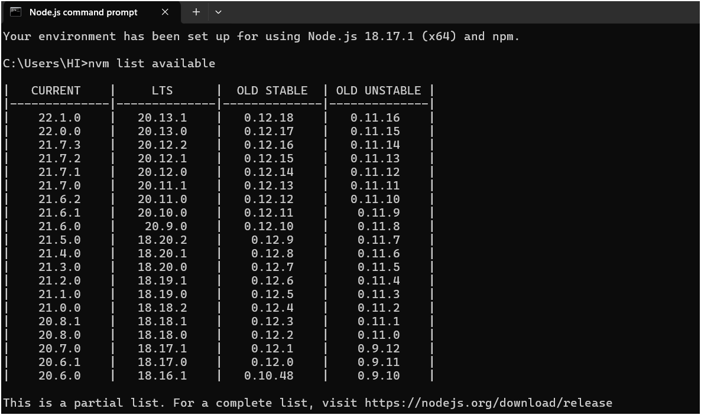

# Booking Online

## 👨‍👩‍👦Contributors
| **🚀FE Leader** | **🚀Member** | **🚀Member** | **🚀Member** | **🚀Member** | **🚀Member** | **🚀Member** |
| :-: | :-: | :-: | :-: | :-: | :-: | :-: |
| [Tuan Anh](https://gitlab.com/tuananh31j) | [QuangMphann](https://gitlab.com/quangphan2705) | [HarmonyHieu](https://gitlab.com/hieutvph46786) | [QuocJin](https://gitlab.com/QuocDL) | [sweetcter](https://gitlab.com/sweetcter) | [Đào Minh](https://gitlab.com/minhtit123) | [MWare CEO](https://gitlab.com/mwarevn) |
|<span style="font-size: 14px;">tuananh31j@gmail.com</span> | <span style="font-size: 14px;">quangphan2705@gmail.com</span> | <span style="font-size: 14px;">hieu707203@gmail.com</span> | <span style="font-size: 14px;">quoclcph18659@gmail.com</span> | <span style="font-size: 14px;">daylasep0175@gmail.com</span>  | <span style="font-size: 14px;">minhdd15112003@gmail.com</span> |  <span style="font-size: 14px;">hunterwolf.work@gmail.com</span>  |
|  |  |  |  |  | | |

## Demo


## Setup

Make sure to install the dependencies:

```bash
# yarn
yarn install
```

or

```bash
#npm
npm install
```

## Development Server

Start the development server on `http://localhost:****`:

```bash
# yarn
yarn dev
```

or

```bash
#npm
npm run dev
```

## Production

Build the application for production:

```bash
# yarn
yarn build
```

or

```bash
#npm
npm run build
```

Locally preview production build:

```bash
# yarn
yarn preview
```

or

```bash
#npm
npm run build
```

## Setup node

` Expected version "^18.18.0 || >=20.0.0"`

If your node version is outside the required range.
Follow these steps

1. Download [nvm-setup.zip](https://github.com/coreybutler/nvm-windows/releases/download/1.1.7/nvm-setup.zip) extract and install it.
2. Execute command `nvm list available` from cmd or gitbash or powershell, this will list all available version of node.
   
3. Use command `nvm install version` e.g. `nvm install 20.0.0` to install on the machine
4. Last once installed use `nvm use version` to use newer version e.g. `nvm use 20.0.0`.
