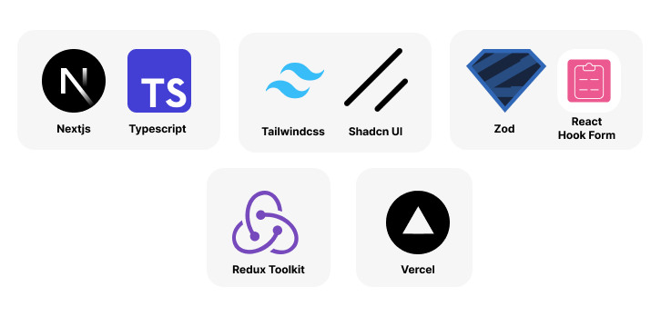

# Booking Online

## 👨‍👩‍👦Contributors
| **🚀FE Leader** | **🚀Member** | **🚀Member** | **🚀Member** | **🚀Member** | **🚀Member** | **🚀Member** |
| :-: | :-: | :-: | :-: | :-: | :-: | :-: |
| [Tuan Anh](https://gitlab.com/tuananh31j) | [QuangMphann](https://gitlab.com/quangphan2705) | [HarmonyHieu](https://gitlab.com/hieutvph46786) | [QuocJin](https://gitlab.com/QuocDL) | [sweetcter](https://gitlab.com/sweetcter) |[MWare CEO](https://gitlab.com/mwarevn) | [Đào Minh](https://gitlab.com/minhtit123) | 
|  |  |  |  |  |  |  |


## Technology Stack



## Demo

https://github.com/user-attachments/assets/e28d1334-90c7-42a2-a725-711625547b7c

## Setup

> <br/>[!NOTE]<br/> **Ensure Node.js is version <i>^18.18.0 || >=20.10.0.</i>**<br /><br />

1. Install the dependencies.

```bash
# npm
npm install
```

2. Run the project.

```bash
# npm
npm run dev
```

or

## Setup with Docker

```sh
# docker
docker-compose up -d
```
